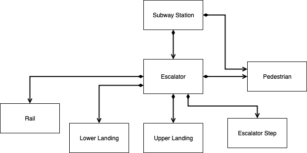

# Assignment 1 - Designing Models and Analyzing Data (Template)
(remove: **text between brackets to be removed**)

> * Participant name: Aaron Necaise  
> * Project Title: (Title of the problem you are looking and modeling)  

# General Introduction
The first part of this assignment explores designing models (and basic Python/Git features).

We will look at **subway model in a city** system. A **subway system** is an underground, tube, or metro, underground railway system used to transport large numbers of passengers within urban and suburban areas - modern subways use different types of electronic data collection sensors to supply information which is used to manage assets and resources efficiently.

The second part of the assignment explores data analysis. Data analysis and visualization is key to both the input and output of simulations. This assignment explores different random number generators, distributions, visualizations, and statistics. Additionally, it will look at getting you accustomed to specifying input and output variables to a system. We will also practice working with real data.

# Part 1: Designing a Model - Subway System
The current project will attempt to simulate the impact of adjusting escalator speed at subway stops on pedestrian traffic.

During the busiest times of the day, subways stops become congested around entry points. Increasing the capacity of these entry points may reduce pedestrian traffic.  With an increasing percentage of the world’s population concentrated in cities—and an increasing urgency to adjust our emission levels—developing efficient public transportation options is an important challenge for the future.  

One anecdotal example of this systemic inefficiency is  the North Bethesda metro stop in Maryland where the escalator often becomes backed up enough that payment terminal are obstructed. 

Historically, it has been important to improve the riding experience of publish transportation to encourage more commuters to use these systems over driving. Many solutions focus on improving the reliability of trains, thus reducing possible delays. Solutions like these depend on lengthy and expensive renovations. 

## (Part 1.1): Requirements (Experimental Design) *(10%)*
(remove: You should start by specifying a set of requirements. I specified a topic a Subway escalator. What exactly does that mean - practice formulating your own set of requirements and an experiment. Define problems cities face and hypothesize how a subway system could help alleviate these issue. This helps you think about your problem communication and system objectives inputs, functions, and outputs - they should be clearly specified.)

* Subway systems in major cities experience severe congestion at rush hour
* One possibility to alleviate this congestion is to increase the throughput of subway escalators, which will in turn decrease transit time of riders
* We want to test whether increasing the escalator speeds will signifcantly impact riders' transit times
* The current project will construct a model that allows us to compare transit time of riders with escalator speeds set between .4 m/s and .8 m/s (standard configurations)
* Transit time will be measured from the time that a pedestrian is waiting at the bottom landing plate of an escalator to the time they exit at the upper landing plate
* A 10% decrease in transit time from current escalator configurations will be considered a significant change that warrants increasing escalator speed
* The modeled will focus on an exit-only escalator (ignoring bidirectional entrances)
* Pedestrians will not be allowed to walk up the escalator, but may occupy the steps non-uniformly (1 or 2 persons per step)
* It is assumed that riders will arrive in blocks at rates directly correlated to train arrival at the platform

## (Part 1.2) Subway (My Problem) Model *(10%)*
(remove: add a high-level overview of your model, the part below should link to the model directory markdown files)
(remove: Look at the [*Object Diagram*](model/object_diagram.md) for how to structure this part of Part 2 for each diagram. Only the Object diagram has the template, the rest are blank. )

* [*Object Diagram*](model/object_diagram.md) - provides the high level overview of components
* [*Class Diagram*](model/class_diagram.md) - provides details of (what are you providing details of)
* [*Behavior Diagram*](model/behavior_diagram.md) - provides details of (what are you providing details of)
* [*Agent / User case* (if appropriate)](model/agent_usecase_diagram.md) - provides details of (what are you providing details of)

## (Part 1.3) Subway (My Problem) Simulation *(10%)*

 A discrete event based simulation will be used to simulate our model of a subway escalator. In this simulation, blocks of subways riders will add to a queue at the bottom of the escalator. New riders will arrive at the escalator at rates that are derived from real world ridership and train schedule data from the Washington D.C. metro. Steps at the bottom of the escalator (position 1) will be loaded with 1-2 riders depending on a random process. The steps will update their position based on the set speed of the escalator. 
 
 Inputs for this simulation would be the frequency that new riders are added to the queue (as well as the number), the speed of the escalator, and the number of steps the escalator contains. This would allow us to adjust our simulation based on the height of an escalator and the traffic experienced by different subway stops. The output of this simulation would be a count of how many subways completed the system and the average amount of time it took them to ride the escalator. While increasing the speed of the escalator will obviously decrease the time it takes to ride it, this simulation will allow us to see if increasing an escalator's speed will have enough of an affect to warrant the decreased safety related to faster escalators. 

## (Part 1.4) Subway City (My Problem) Model *(10%)*
[*Code template*](code/README.md) - Starting coding framework for the (insert your exact problem here.)
You are expected to create the python files - the code should run without errors, create and object(s) for your system, but not provide function detail.

## (Part 1.5) Specifying the Inputs to a System *(10%)*
(remove the below points once ideas are satisfied)
* Indepdent Variables: (1)Speed of escalator (4 m/s, 6 m/s, or 8 m/s) and (2)height of escalator
* Dependent Variables: (1) Total Escalator capacity per hour and (2) Average transit time
* Our  data will come from synthetic data that is generated using WMATA publicly available ridership information
* What kind of statistics are important to capture this input data
* Because we are comparing group averages,we will use an ANOVA to compare capacity and transit time accross groups
* A clusted bar chart will be used to visual group differences between 3 set speeds of the escalator
* We can embedd the data from our clustered bar graph in an infograph thats looks like a series of escalators 

# Part 2: Creating a Model from Code

## (Part 2.1) *P*ortable *O*rganic *T*rouble-free *S*elf-watering System (*POTS*) Model *(10%)*
Here [*we provide an overview*](code/POTS_system/README.md) of the **P**ortable **O**rganic **T**rouble-free **S**elf-watering System (**POTS**) Model and provide a source code template for the code found in  [*the following folder*](code/POTS_system/). Please create a **class** diagram of this model (replace the placeholder diagram). (you can use paper and pencil or a digital tool).

# Part 3: Data Analysis

## (Part 3.1) - Real Data *(10%)*
Find a datasource that looks at part of this model - subway stations locations / escalator number, heights, widths / volume of passangers - ridership numbers   (_fits_ - we are pretty loose here, it can be anything.)

* Write up a paragraph that describes the data and how it fits into your system.
* Load the data into Python
* Calculate a few useful statistic on the data - keep it simple- STD, means, etc..., this is just designed * to get used to working with real data. Explain the insights you derive from these statistics.
* Visualize the raw data - visualize a few critical aspects of the data to better describe what it is, what it is showing, and why its useful to your system.
* Calculate and plot some summary statistics that better describe the data.

One dataset that will help  to build a framework for this simulation is the WMATA ridership data set ([*found here*](Data/). This data set contains the historical daily average ridership for each metro station in the DC metro system in the month of May. This data fits into the current simulation by providing real world data that we can use to feed our model as inputs. For example, this simulation requires some estimate of the number of riders per hour that a metro station experiences. 

After a calculating descriptive statistics, it was found that the average ridership for all stations in WMATA was ~6883 (SD = 5586) in 2018. This number as remained relatively stable compared to the 2017 average (mean = 6814) and the 2016 average (mean = 7119). Descriptive statistics can be found [*here*](Data/)

From these data, we see that ridership is stable year over year, but varies greatly station from station. The busiest stations can approach 30,000 average riders. For the current stimulation, it would make sense to model our system after the busiest WMATA stops. 

(Add your plots and visualization here)
(Put your data into the data directory)

## (Part 3.2) -  Plotting 2D Random Number Generators *(15%)*
This portion of the assignment looks at generating random numbers in Python and understanding how to properly plot them. Plot two different random numbers, pseudo random and quasi random, for five different N values. There should be 10 subplots, all properly formatted 2D plots. Note, each of the N points will have two coordinates, an x and a y, therefore you will need to generate two random numbers for each point. You should replace the image with your results in a simalar format. Discuss how the patterns differ. Feel free to change the N values from the suggested N values in the image to state your case.

## (Part 3.3) -  Plotting 1D Random Distributions *(15%)*
Now, choose three different distributions to plot in 1D, or as a histogram. Choose a pseudo-random generator and generate three different distributions. Example distributions are Uniform (part 8), Normal, Exponential, Poisson, and Chi-Squared, but feel free to use any three distributions of your choice. Again, plot each distribution for five different Ns. This will result in 15 different subplots, formatted similar to the image in Part 8. Include your properly formmated 1D plots below and breifly describe what we are looking at and how things change as N is changed.

Repeat the above using a quasi-random generator. Discuss the similarities and differences.
