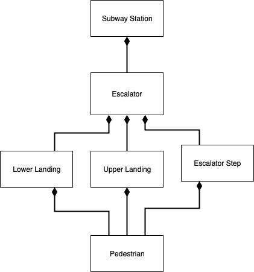
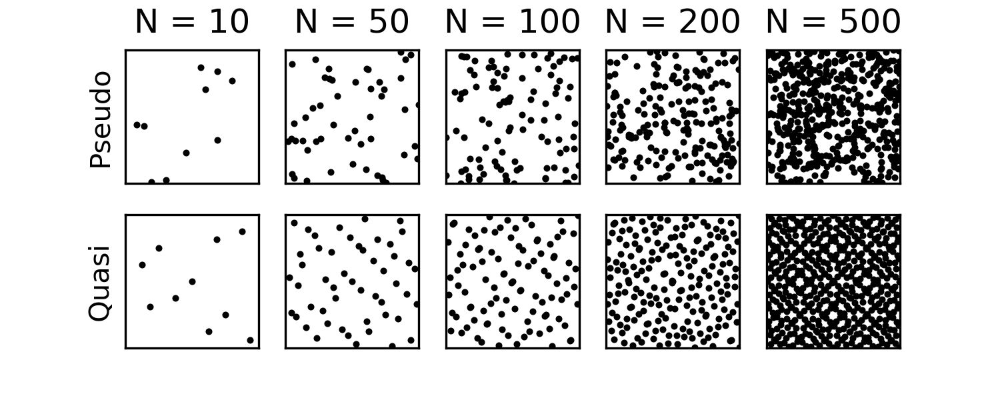
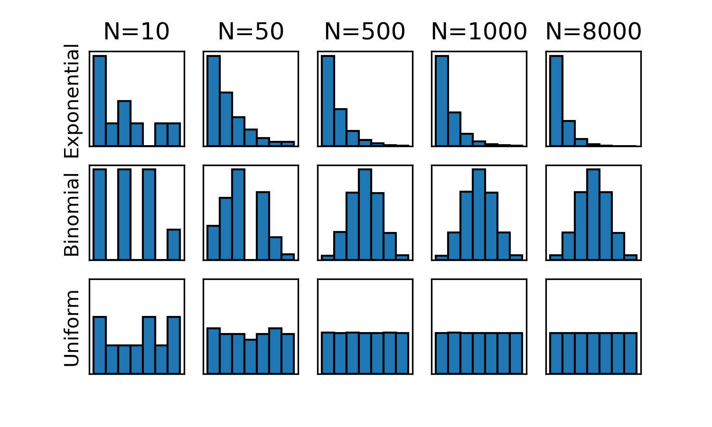

# Assignment 1 - Designing Models and Analyzing Data (Template)

> * Participant name: Aaron Necaise  
> * Project Title: Escalator Speed and Metro Transit Time

# General Introduction
The first part of this assignment explores designing models (and basic Python/Git features).

We will look at **subway model in a city** system. A **subway system** is an underground, tube, or metro, underground railway system used to transport large numbers of passengers within urban and suburban areas - modern subways use different types of electronic data collection sensors to supply information which is used to manage assets and resources efficiently.

The second part of the assignment explores data analysis. Data analysis and visualization is key to both the input and output of simulations. This assignment explores different random number generators, distributions, visualizations, and statistics. Additionally, it will look at getting you accustomed to specifying input and output variables to a system. We will also practice working with real data.

# Part 1: Designing a Model - Subway System

The current project will attempt to model & simulate the impact of changing escalator speeds on the amount pedestrian traffic in subway stations. 

During the busiest times of the day, subways stops become congested around their entry points. In smaller cities, like the D.C. metro area, congestion at stops can deter riders. This is an important consideration because policy and funding decisions are be made based on usage rates.

With an increasing percentage of the world’s population concentrated in cities, developing efficient public transportation options is an important challenge for the future. Part of this challenge will be to encourage more commuters to utilize public systems as opposed to using their cars. 

One anecdotal example of this systemic inefficiency is the North Bethesda metro stop in Maryland where the escalators often becomes backed up enough that the payment terminals are obstructed. As a result, riders often miss their train while waiting in these extended queues. 

Historically, many attempts have been made to alleviate traffic and improve conditions in public transportation systems. However, these solutions typically focus on improving the reliability of trains in order to reduce delays. Solutions like these depend on lengthy and expensive renovations. 

## (Part 1.1): Requirements (Experimental Design) *(10%)*

* Subway systems in major cities experience severe congestion at rush hour. 
* One possible solution to this congestion is to increase the throughput of subway escalators, which will in turn decrease transit time of riders navigating the subway.
* We want to estimate to what extent that increasing the escalator speeds will  impact riders' transit times and escalator throughput
* The current project will construct a model that takes escalator configurations as inputs (0.4 m/s and 0.8 m/s; standard configurations) and allows us to measure transit time of riders on the escalator 
* Transit time will be measured from the time that a pedestrian is waiting at the bottom landing plate of an escalator to the time they exit at the upper landing plate
* A 10% decrease in transit time from current escalator configurations in the WMATA subway system will be considered a significant enough change to justify the higher cost associated with faster escalator operating speeds
* The modeled will focus on an exit-only escalator (ignoring bidirectional entrances)
* Pedestrians will not be allowed to walk up the escalator, but may occupy the steps non-uniformly (1 or 2 persons per step)
* It is assumed that riders will arrive in blocks at rates directly correlated to train arrival at the platform

## (Part 1.2) Subway Escalator Speed and Metro Transit Time Model *(10%)*

See below for a high level overview of the proposed subway escalator model. The object diagram here visualizes the major components of our subway model as well as how those components will be related to each other within the system. 

* [*Object Diagram*](model/object_diagram.md) - provides the high level overview of components

* [*Class Diagram*](model/class_diagram.md) - provides details of specific class attributes and functionality

* [*Behavior Diagram*](model/behavior_diagram.md) - this activity diagram provides details of the major system processes and the workflow of the different modeled components

* [*Agent / User case* (if appropriate)](model/agent_usecase_diagram.md) - provides details of (what are you providing details of)

## (Part 1.3) Subway Escalator Speed and Metro Transit Time Simulation *(10%)*

 A discrete event based simulation will be used to simulate our model of a subway escalator. In this simulation, blocks of subways riders will add to a queue at the bottom of the escalator. New riders will arrive at the escalator at rates that are derived from real world ridership and train schedule data from the Washington D.C. metro. Steps at the bottom of the escalator (position 1) will be loaded with 1-2 riders depending on a random process. The steps will update their position based on the set speed of the escalator. 
 
 Inputs for this simulation would be the frequency that new riders are added to the queue (as well as the number), the speed of the escalator, and the number of steps the escalator contains. This would allow us to adjust our simulation based on the height of an escalator and the traffic experienced by different subway stops. The output of this simulation would be a count of how many subways completed the system and the average amount of time it took them to ride the escalator. While increasing the speed of the escalator will obviously decrease the time it takes to ride it, this simulation will allow us to see if increasing an escalator's speed will have enough of an affect to warrant the decreased safety related to faster escalators. 

## (Part 1.4) Subway City Escalator Speed and Metro Transit Time Model *(10%)*

[*Code template*](code/README.md) - Starting code framework for the Escalator Speed and Metro Transit Time model.
([*Code Found Here*](/code/)

## (Part 1.5) Specifying the Inputs to a System *(10%)*

* Independent Variables: (1)Speed of escalator (4 m/s, 6 m/s, or 8 m/s) and (2)height of escalator
* Dependent Variables: (1) Total Escalator capacity per hour and (2) Average transit time
* Our  data will come from synthetic data that is generated using WMATA publicly available ridership information
* Because we are comparing group averages, we can use an ANOVA to compare capacity and transit time across groups in our simulation
* A clustered bar chart will be used to visual group differences between 3 set speeds of the escalator
* We can embed the data from our clustered bar graph into an infographic that looks like a series of escalators. The size of the escalator will correspond to our output variables (capacity and average transit time).

# Part 2: Creating a Model from Code

## (Part 2.1) *P*ortable *O*rganic *T*rouble-free *S*elf-watering System (*POTS*) Model *(10%)*
Here [*we provide an overview*](code/POTS_system/README.md) of the **P**ortable **O**rganic **T**rouble-free **S**elf-watering System (**POTS**) Model and provide a source code template for the code found in  [*the following folder*](code/POTS_system/). 

# Part 3: Data Analysis

## (Part 3.1) - Real Data *(10%)*

One dataset that will help  to build a framework for this simulation is the WMATA ridership data set ([*found here*](Data/)). This data set contains the historical daily average ridership for each metro station in the DC metro system in the month of May. This data fits into the current simulation by providing real world data that we can use to feed our model as inputs. For example, this simulation requires some estimate of the number of riders per hour that a metro station experience. 

After calculating descriptive statistics, it was found that the average ridership for all stations in WMATA was ~6883 (SD = 5586) in 2018. This number as remained relatively stable compared to the 2017 average (mean = 6814) and the 2016 average (mean = 7119). Descriptive statistics can be found [*here*](Data/)

A histogram of our data reveals that most stations have relatively low ridership numbers throughout the month (<5000);however, because several stations approaching 30k daily riders, ridership numbers are highly variable. 

From these data, we see that ridership is stable year over year. The busiest stations can approach 30,000 average riders. For the current stimulation, it would make sense to model our system after the busiest WMATA stops because these particular stops would be the problem areas in the system.

## (Part 3.2) -  Plotting 2D Random Number Generators *(15%)*
This portion of the assignment looks at generating random numbers in Python and understanding how to properly plot them. Plot two different random numbers, pseudo random and quasi random, for five different N values. There should be 10 subplots, all properly formatted 2D plots. Note, each of the N points will have two coordinates, an x and a y, therefore you will need to generate two random numbers for each point. You should replace the image with your results in a simalar format. Discuss how the patterns differ. Feel free to change the N values from the suggested N values in the image to state your case.

## (Part 3.3) -  Plotting 1D Random Distributions *(15%)*
Now, choose three different distributions to plot in 1D, or as a histogram. Choose a pseudo-random generator and generate three different distributions. Example distributions are Uniform (part 8), Normal, Exponential, Poisson, and Chi-Squared, but feel free to use any three distributions of your choice. Again, plot each distribution for five different Ns. This will result in 15 different subplots, formatted similar to the image in Part 8. Include your properly formatted 1D plots below and briefly describe what we are looking at and how things change as N is changed.

Looking at the differences (above) of random samples from three different types of distributions, it’s clear that as our sample size gets larger the sample gets closer to the population distribution. With small sample sizes (n=10), it's hard to notice much of a difference between samples of different distributions. 

When using a Quasi-Random generator to create distributions, the generated data is much more closely fit to the sampled distribution at lower N's. Samples generated this way probably have considerably less variability.

