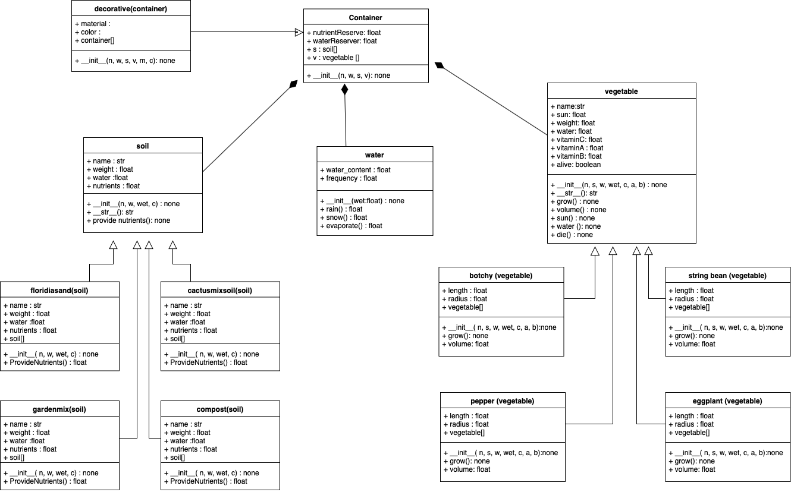

## **P**ortable **O**rganic **T**rouble-free **S**elf-watering System (**POTS**) Model

The POTS Model is a small system for simulating the lifespan of various vegetables based on the nutrients and water available to plant. The model allows us to select from four vegetables (eggplant, bok choy, pepper, and string bean) and four soil types (compost, garden mix, Florida sand, and garden mix) that are contained within the container object. 

## POTS Class Diagram

The water object allows for additional events that affect the water content of the container, such as rain, snow, and evaporate that can be incorporated into our simulation. However, water and nutrients can simply be depleted over time, which results in the death of the vegetable.
